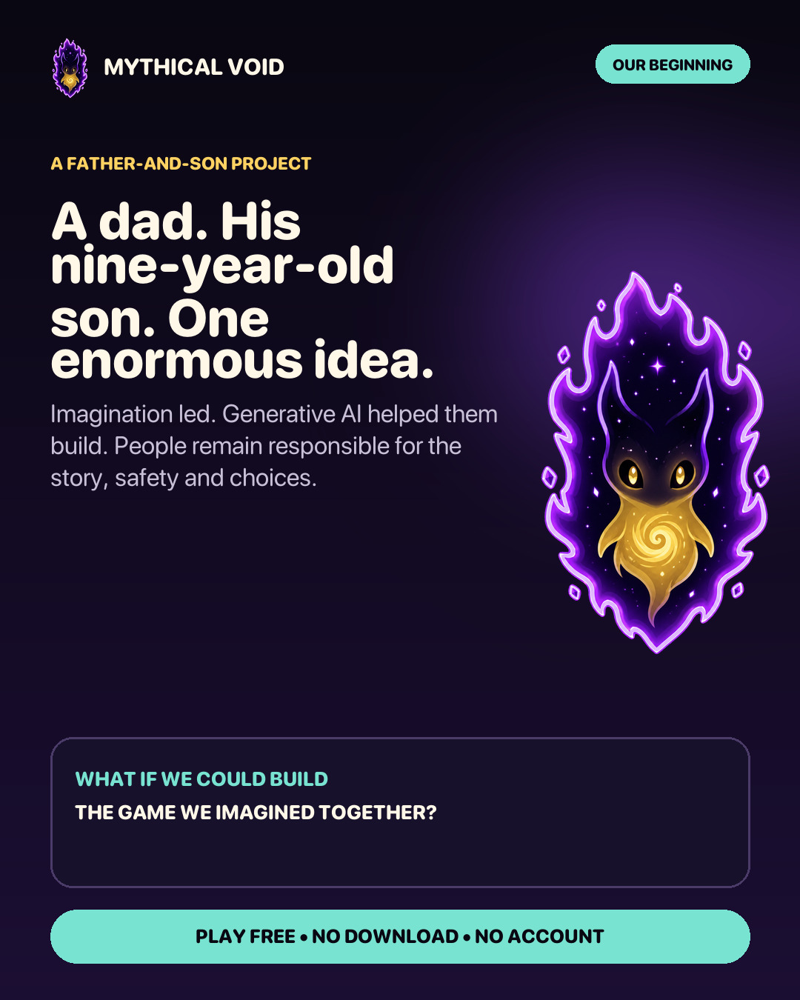
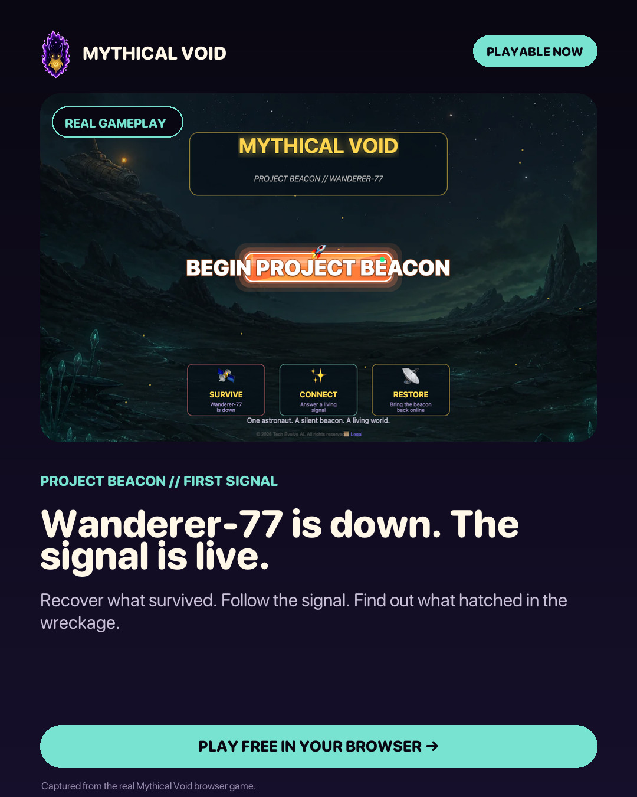
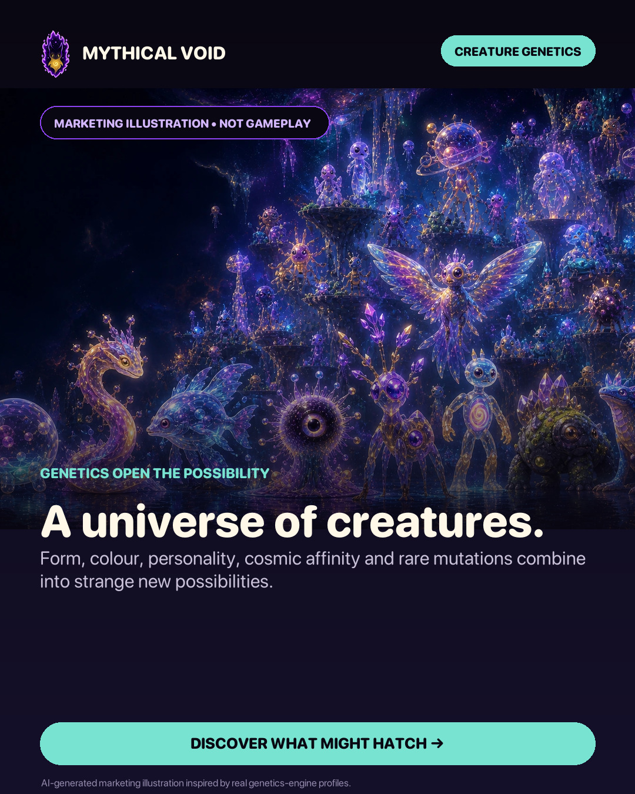
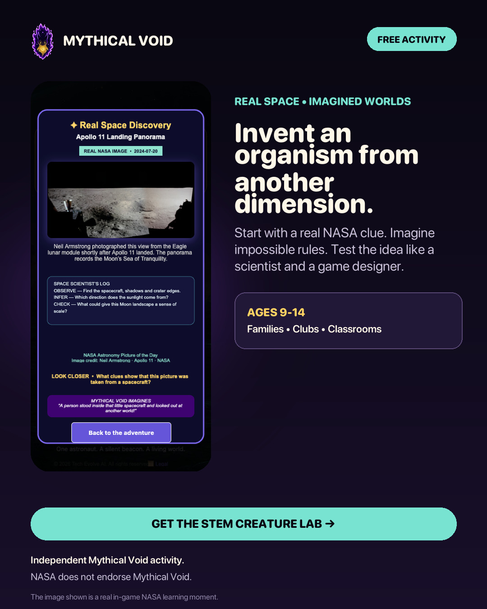
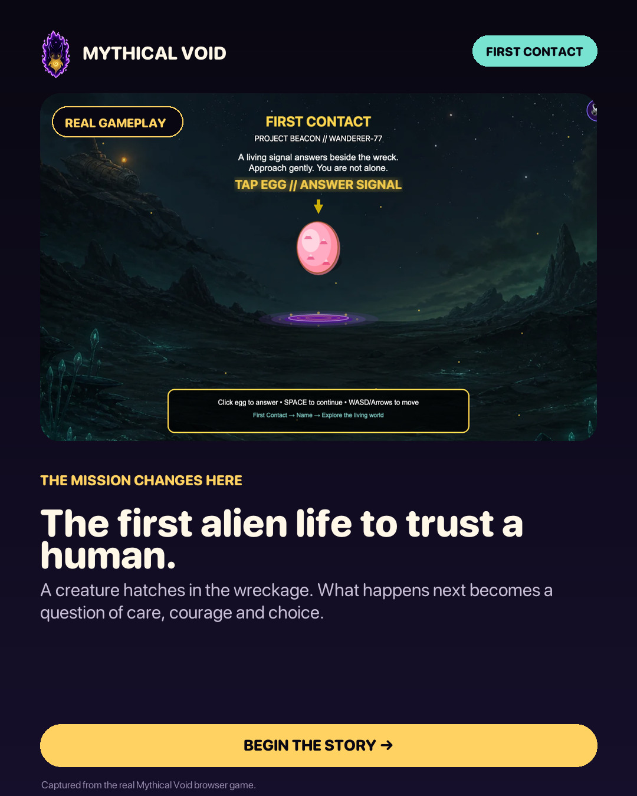

# First Signal social review

Five finished portrait previews are ready. They are not published or scheduled.

Kevin approves the exact visual and caption together after an official channel exists. A change to the wording, image, link, disclosure, planned time or channel means it must be checked again.

## 1. Our beginning

Use the father-and-son story without showing or naming Kevin's child. The approved caption and alt text are recorded as `SS-001` in `first-signal-social.json`.

## 2. Playable now

This contains real gameplay from `GP-001`. The caption must not imply that the screenshot is generated marketing art.

## 3. A universe of creatures

This is a generated marketing illustration inspired by genetics-engine profiles. It is clearly labelled as not gameplay.

## 4. STEM Creature Lab

This contains the real in-game Apollo 11 learning moment. The NASA source, credit and non-endorsement boundary remain required.

## 5. First contact

This contains real gameplay from `GP-003`. It introduces the story without claiming unrestricted intelligence, sentience or consciousness.

## Approval checklist

- [ ] The official channel URL is recorded.
- [ ] Kevin has checked the exact visual and caption together.
- [ ] The destination opens correctly.
- [ ] The alt text and disclosure are ready for that channel.
- [ ] A named adult can review comments at the planned time.
- [ ] No private contact with a child, paid promotion or automated replies are enabled.

The machine-readable captions, proof references, file fingerprints and authority state are in [`first-signal-social.json`](../campaigns/first-signal-social.json).
