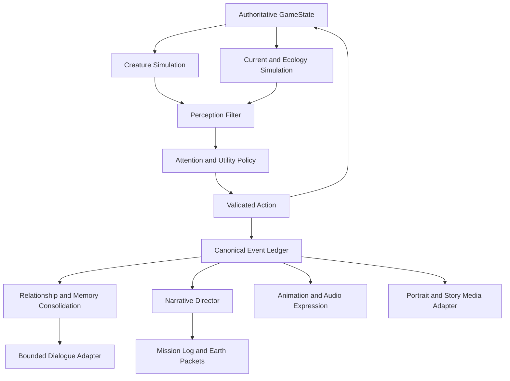

# Mythical Void: Product, Narrative, and Technical Plan

**Status:** Proposed for approval  
**Date:** 30 July 2026  
**Scope:** Player clarity, Project Beacon campaign, the planetary Current,
perceived creature aliveness, child-safe AI, endings, and production delivery.

> **Chronology update:** The ending and franchise-route sections in this
> proposal are superseded by
> `MYTHICAL_VOID_FRANCHISE_IMPLEMENTATION_GUIDE.md`. Remain and Defend, Secret
> Homecoming, and Open First Contact are now one sequential saga rather than
> incompatible sequel timelines.

This plan combines the current game implementation, the Project Beacon story
developed to date, and the research in
`MYTHICAL_VOID_RESEARCH_HANDOFF_FOR_CODEX.md`.

No implementation should begin from this document until the approval decisions
at the end are confirmed.

---

## 1. Executive Recommendation

Mythical Void should be built around one connected dramatic and mechanical
idea:

> The astronaut was sent to find resources that could help Earth survive, but
> discovers that the resource is part of a living planetary system already
> being used to keep another world alive.

The game must not leave this premise in developer notes or late exposition.
Players should learn it through:

- what their companion notices and refuses to do;
- visible differences between healthy and drained regions;
- the consequences of taking and restoring energy;
- delayed Project Beacon instructions from Earth;
- ship repairs that depend on both Earth engineering and creature knowledge;
- memories and trust built through shared events;
- choices made throughout the campaign, not only on the final screen.

The defining product proposition becomes:

> **A science-fiction artificial-life adventure where a stranded astronaut and
> a unique alien companion learn to survive together, uncover a shared
> planetary crisis, and decide whether discovery becomes extraction,
> protection, or first contact.**

---

## 2. Recommended Canon

### 2.1 What Earth knows

Earth does **not** know about the Current, intelligent creatures, settlements,
or the planet's living network.

Earth has detected:

- unusually dense and stable energy readings;
- mineral and biological signatures that could support Project Beacon;
- an orbital or Void-related instability affecting the planet;
- no previously confirmed intelligent life.

The public account describes the planet as remote, unclaimed, probably sterile,
and likely doomed. This framing makes extraction appear practical and morally
easy.

Project Beacon's original directive is therefore credible from Earth's limited
information:

1. survey the planet;
2. recover biological and mineral samples;
3. assess the anomalous energy source;
4. restore communications;
5. report anything that could help Earth.

### 2.2 What Earth gets wrong

Earth treats absence of evidence as evidence of absence.

Its instruments identify an energy reserve but fail to recognize that the
energy:

- flows through living habitats;
- supports hatching and creature development;
- connects distant settlements;
- helps regulate atmosphere, geology, and Void instability;
- may be involved in keeping the planet from its predicted collision or
  collapse.

Earth does not need to be uniformly evil. A desperate government, scientists
trying to help, and corporate extraction interests can have different motives.
The danger comes from urgency, distance, incomplete evidence, and institutions
that classify a living world as inventory.

### 2.3 The collision story

**Recommended truth:** the danger is real, but Earth's conclusion is wrong.

The planet is moving toward a Void convergence, orbital collapse, or related
catastrophe. Earth believes this makes the world expendable. The creatures are
already using and restoring the Current to stabilize it.

Extraction would:

- make useful energy available to Earth in the short term;
- weaken the alien planet's stabilizing network;
- accelerate the very catastrophe used to justify extraction.

This creates two legitimate survival needs without making exploitation the
only possible answer.

### 2.4 The hopeful scientific answer

The story must remain hopeful about technology and exploration.

The final discovery is not unlimited magical energy. It is a method:

- Earth engineering can measure, contain, and transport energy.
- Creature technology can grow, tune, and restore Current pathways.
- Together they may create a renewable resonance exchange that neither society
  could build alone.

Cooperation remains difficult and risky. It is earned through consent, trust,
evidence, and restraint rather than delivered as an effortless miracle.

### 2.5 Recommended terminology

| Term | Player-facing meaning |
| --- | --- |
| **The Current** | The energy-and-life network running through the planet |
| **Living Signal** | A readable surface pulse from a healthy Current node |
| **Fading Signal** | A node losing energy or ecological support |
| **Severed Signal** | A collapsed or extracted node that no longer connects |
| **Restored Signal** | A damaged node returned to the network |
| **Project Beacon** | Earth's mission to find evidence, resources, and hope |
| **Wanderer-77** | Flight 23's damaged ship and eventual communications bridge |

"Death Signal" should remain an astronaut's informal or late-story term, not
the first UI label. "Fading" and "Severed" describe the mechanic more clearly
and avoid implying that every marker represents a dead creature.

---

## 3. Player Clarity Contract

The game should never require players to infer basic rules from developer
intent. At each stage, they should understand the following without opening a
wiki.

### By minute 5

The player knows:

- they are the astronaut-pilot of Wanderer-77;
- Earth is in crisis and Project Beacon was sent to find help;
- the ship crashed before it could report;
- the uplink is silent;
- the mission originally included samples and resource assessment.

### By minute 10

The player knows:

- the hatchling notices and responds to them;
- it may be intelligent, but communication is uncertain;
- it is not automatically obedient;
- its behavior, not a rarity card, is the basis of first contact;
- naming is an act of recognition, not ownership.

### By minute 15

The player knows:

- Living Signals are local planetary phenomena, not calls to Earth;
- the suit records scans locally;
- the creature can perceive something the astronaut cannot;
- energy can power survival equipment;
- taking energy changes the local environment;
- restoration is possible;
- the next objective is to follow the signal network with the companion.

### By the campaign midpoint

The player knows:

- signals connect multiple habitats and settlements;
- regions with weaker Current contain less abundant life;
- Earth has classified the energy as extractable;
- the creatures are coordinating restoration work;
- the planet's predicted catastrophe is not a reason to abandon it;
- the companion has become a friend and collaborator through shared events.

### Before the ending

The player knows:

- the Current helps stabilize the planet;
- Earth still has a legitimate crisis;
- extraction could help Earth temporarily while condemning this world;
- safe exchange may be possible through combined technology;
- repairing the uplink gives the player control over evidence and coordinates;
- no creature should travel to Earth without understanding and choosing the
  risk.

---

## 4. Story Delivery Across the Existing Realms

### Prologue and Sanctuary: Survival

- Play the cached Project Beacon mission archive.
- Establish that two-way communication is impossible.
- Hatch and name the companion.
- Introduce one healthy signal and one weakened reading.
- Use a small emergency siphon to power essential equipment.
- Show an immediate, reversible environmental response.
- Let the creature demonstrate the first restoration action.

The player is not condemned for the emergency siphon. It is a discovery moment,
not a hidden morality trap.

### Mythical Forest: Recognition

- Show abundant life around healthy Current pathways.
- The companion guides the astronaut around a node rather than through it.
- The player learns to observe before interacting.
- The first guardian restoration reveals that ship parts and living structures
  are connected.

### Crystal Caves: Consequence

- Introduce a region damaged by previous natural or artificial draining.
- Compare a Fading Signal with a Severed Signal.
- Reveal that stronger extraction readings correlate with ecological silence.
- Recover the Resonant Edge katana upgrade by restoring, not mining, crystal.

### Stellar Reef: Network

- Show the Current crossing biome boundaries.
- Receive a delayed one-way Earth packet describing a "viable energy reserve"
  on a "doomed, uninhabited world."
- Let the player and companion jointly map the network.
- Establish that the signals are coordinated, not random anomalies.

### Void Peaks: Society

- Reveal warnings moving between distant creature settlements.
- Show that the companion is granting the astronaut access to a conversation.
- Introduce evidence that the predicted collision is real but not inevitable.
- Add atmospheric stabilizer gear developed from Earth and creature
  technologies.

### Aurora Depths: Shared Crisis

- Prove that the Current contributes to planetary stability.
- Receive a more urgent Earth packet requesting extraction viability.
- Reveal a safe but incomplete resonance-transfer prototype.
- Upgrade the katana's guard and non-lethal restoration functions.
- Make the astronaut's report dossier visibly diverge from Earth's original
  classification.

### Final Void: Responsibility

- Confront the force or character attempting to convert the network into an
  extractive system.
- Use the katana, companion abilities, and restored network together.
- Repair Wanderer-77 and the uplink.
- Require the player to choose what evidence and coordinates leave the planet.
- Base available endings on trust, restored nodes, evidence, and prior conduct.

---

## 5. Communication With Earth

**Recommendation:** delayed one-way packets during the game; no live
conversation until the ending.

This keeps the astronaut isolated while preventing Earth from disappearing
from the story.

### Delivery model

- The crash preserves several pre-recorded mission fragments.
- Repair milestones restore portions of the receiver.
- The ship occasionally receives delayed, compressed instructions.
- The astronaut cannot confirm receipt or transmit discoveries.
- Signal scans remain in a local evidence dossier.
- The final uplink restoration is the first point at which the player can send
  coordinates and evidence.

### Dual-record mission interface

The Project Beacon log should show two evolving columns:

| Earth classification | Field observation |
| --- | --- |
| Energy anomaly | Current node |
| Unused terrain | Active habitat |
| No confirmed intelligence | Coordinated response |
| Extraction candidate | Planetary life support |
| Doomed world | World attempting recovery |

This interface communicates changing understanding without long speeches.

---

## 6. Ending Structure

### Ending A: Secret Return, Earthbound

- Repair Wanderer-77.
- Conceal the world's coordinates and evidence of intelligent life.
- Return to Earth with one informed, willing creature who wants to understand
  humanity and help both worlds.
- Protect the creature's identity while navigating Earth, the Sensei
  connection, and the risk of government or corporate discovery.

This is cautious and protective, not a perfect victory. It seeds an
Earth-based follow-on game about secrecy, trust, learning, and deciding when
humanity is ready for the truth. The creature is a partner, never an abducted
specimen.

### Ending B: Open First Contact

- Tell the creatures what Earth needs and what contact risks.
- Share the full evidence with a restricted scientific channel.
- Let willing creature representatives decide whether to travel.
- Demonstrate the first cooperative resonance exchange.

This is the most publicly hopeful ending and should require high trust,
substantial restoration, and honest conduct. It seeds an ambassador game about
science, diplomacy, competing institutions, and cooperation between worlds.

### Ending C: Remain and Defend

- Silence or erase the route.
- Convert Wanderer-77 into a shelter, laboratory, and observatory.
- Help stabilize the alien planet first.
- Continue searching for a safe way to help Earth.

This protects the immediate crisis while turning away from home. It seeds a
planet-based follow-on game about restoration, creature culture, exploration,
and defending the Current from future extraction threats.

### Optional cautionary ending

A deceptive extraction or non-consensual "specimen" route may exist as a
clearly harmful consequence path, but it should not be presented as morally
equivalent to informed first contact. For a younger audience, implication and
aftermath are preferable to graphic punishment.

### Ending design rule

The final button should confirm a relationship already expressed through play.
It must not be the first time the game asks whether the player values this
world.

### Franchise route model

The three endings are sequel routes, not three full post-game campaigns inside
the first Mythical Void release:

| Route key | Immediate ending | Follow-on game direction |
| --- | --- | --- |
| `secret_return` | Conceal the world and return with a willing companion | Earth survival, secrecy, the Sensei connection, and learning when to reveal the truth |
| `first_contact` | Disclose the world with consent and attempt cooperation | The astronaut as an accidental ambassador between societies |
| `planet_guardian` | Stay, protect the Current, and help the world recover | Restoration, creature culture, exploration, and planetary defense |

Each ending needs a satisfying resolution, a short route-specific teaser, and
a durable handoff. It does not need to contain the sequel itself.

### Campaign legacy capsule

On completion, create a versioned, privacy-minimized
`CampaignLegacyCapsule`. It allows a future game to reconstruct what matters
without importing the full save:

- route key and canonical ending version;
- companion ID, player-given name, appearance seed, traits, and portrait
  provenance;
- bond, trust, consent, and key relationship-event IDs;
- Current nodes restored and evidence discovered;
- Resonant Edge, astronaut gear, and companion ability upgrades;
- disclosure, extraction, and risk decisions;
- save-schema version, game build, completion date, and integrity checksum.

The capsule must contain no player personal data. The first game's regular save
remains playable, while the capsule becomes the stable narrative contract
between Mythical Void titles.

---

## 7. Perceived-Aliveness Gap Analysis

| Layer | Current status | Required production work |
| --- | --- | --- |
| Body/state | Partial | Unify duplicated energy/mood fields; make needs alter behavior and animation |
| Perception | Missing in live play | Range, visibility, hearing, Current sensitivity, nearby affordances |
| Attention | Missing | One active target, visible gaze/facing, distraction and invalidation |
| Motivation | Offline prototype | Utility scoring from drives, personality, trust, and context |
| Action | Partial scripted actions | Small validated action vocabulary with world consequences |
| Autonomy | Offline only | Safe live idle choices, self-care, exploration, hesitation, refusal |
| Learning | Missing | Reinforced associations and player-visible evidence of learning |
| Memory | Multiple partial systems | Canonical event provenance, retrieval, correction, deletion, consolidation |
| Expression | Partial animation | Simulation-aligned gaze, anticipation, reaction, recovery, and silence |
| Relationship | Numeric bond values | Evidence-backed trust, caution, repair, consent, and rituals |
| Lifecycle | Implemented but coercive | Safe aging modes; remove abandonment and absence punishment |
| Inheritance | Strong procedural base, mostly presentational | Behavioral genotype/phenotype parameters and replayable seeds |
| Social ecology | Offline placeholder | Evidence-backed creature relationships, imitation, teaching |
| Culture | Future concept | Defer until one creature and one family are convincing |

### Current architectural risks

- `CreatureAgent` makes random offline decisions but is not the live simulation.
- Creature energy, mood, bond, and relationship values exist in several places.
- `CreatureMemory` and `LongTermMemory` store free text without a canonical
  simulation event ledger.
- `CreatureAIController` is an expressive chat layer and currently uses
  overly young, instantly affectionate language.
- Personality labels affect some multipliers but are not consistently visible
  in attention and action.
- Offline happiness decay, abandonment, care streak pressure, and compulsory
  departure conflict with the approved child-safe direction.
- Current story debriefs explain important facts after missions, but gameplay
  rarely demonstrates them.
- The current ending offers only Earth or silence and does not represent the
  three intended outcomes.

---

## 8. Systems to Reuse

The existing game should be evolved, not broadly rewritten.

Reuse:

- `GameState` versioned persistence, events, and migration pattern;
- Project Beacon configuration, mission log, field reports, and quest sequence;
- Living Signal survey and Signal Garden as early Current interfaces;
- existing six-realm progression and guardian restoration structure;
- personality axes and procedural creature genetics;
- Creature Animation Controller and stage visual resolver;
- mobile control dock and modal suspension lifecycle;
- field kit, katana upgrade progression, and ship recovery systems;
- Supabase optional cloud-save boundary;
- generated portrait specification and secure server function architecture;
- existing tests and local preview routes.

Replace or consolidate only where there are competing sources of truth.

---

## 9. Target Technical Architecture

### Authority rules

- GameState, simulation, and validators own facts.
- The event ledger records meaningful state changes.
- The Narrative Director consumes facts and releases authored story beats.
- Dialogue may explain verified state but may not create facts.
- AI media may depict verified creature identity and events but may not alter
  progression.
- Every system works with AI providers unavailable.

### Core new schemas

1. `SimulationEvent`
   - event ID, time, actors, location, event type, before/after delta,
     salience, source.
2. `CurrentNode`
   - node ID, biome, state, capacity, flow, ecological health, linked nodes.
3. `PerceptionSnapshot`
   - visible/heard/sensed entities and salience.
4. `AttentionState`
   - target, reason, start time, confidence.
5. `ActionProposal`
   - allowed action, target, motive, confidence.
6. `RelationshipState`
   - trust, familiarity, caution, respect, repair, evidence event IDs.
7. `EvidenceDossier`
   - Earth classification, field conclusion, supporting event IDs, disclosure
     state.

---

## 10. Feature Plan

### P0: Canon and Safety Foundation

**Priority:** Release blocker

- Approve the canon and terminology in this document.
- Add a single story-state and evidence model.
- Remove or disable absence punishment, offline happiness loss, abandonment
  language, and streak anxiety.
- Keep return rewards non-escalating and non-punitive if retained.
- Replace compulsory 90-day departure with an explicit age-appropriate mode.
- Rewrite instantly affectionate and babyish first-contact/chat copy.
- Preserve current saves through migrations.

**Exit gate:** leaving the game cannot harm the creature or pressure a child to
return.

### P1: First 15 Minutes and Proof of Life

**Priority:** Release blocker

- Clarify mission, uplink status, signals, and next actions.
- Add one healthy and one fading Current node.
- Add a reversible emergency siphon and restoration interaction.
- Give the companion live drives, perception, attention, and 6-10 validated
  actions in the Sanctuary.
- Add visible gaze, hesitation, anticipation, reaction, and recovery.
- Add the canonical event ledger and a developer timeline.
- Persist learned and relationship state.
- Keep moment-to-moment behavior local and deterministic under a seed.

**Exit gate:** without input for five minutes, the creature behaves coherently;
a 9-12-year-old tester can explain what it noticed, wanted, and did.

### P2: Current Ecology and Two-Realm Vertical Slice

**Priority:** 1.0 core

- Build the node state machine: Living, Fading, Severed, Restored.
- Connect node health to flora, ambient creatures, lighting, audio, resources,
  and companion behavior.
- Add observe, siphon, protect, redirect, and restore actions.
- Convert Mythical Forest and Crystal Caves to demonstrate abundance and loss.
- Add the dual-record Project Beacon dossier.
- Integrate Resonant Edge restoration with the Current.

**Exit gate:** testers can identify healthier and weaker regions from the world,
not only from labels.

### P3: Shared-Crisis Campaign

**Priority:** 1.0 core

- Author delayed Earth packets at ship-repair milestones.
- Add Current-network discoveries across Stellar Reef, Void Peaks, and Aurora
  Depths.
- Reveal settlements and the creature warning network.
- Introduce collision evidence in stages.
- Add Earth/creature hybrid atmospheric gear.
- Let player conduct update the astronaut's field conclusions.
- Make companion trust and autonomy visible in mission interactions.

**Exit gate:** before the final realm, players can explain both planets' needs
and why extraction is not a neutral solution.

### P4: Final Responsibility and Endings

**Priority:** 1.0 release

- Connect the final antagonist to extractive ideology and mechanics.
- Require restored Current routes, the katana, companion skills, and astronaut
  gear in the final encounter.
- Implement the three franchise routes: Secret Return, Open First Contact, and
  Remain and Defend.
- Add creature consent and risk disclosure to every route involving travel.
- Derive ending eligibility from evidence, trust, restoration, and conduct.
- Preserve choices for New Game+ without presenting a single simplistic score.
- Build, validate, version, and save the `CampaignLegacyCapsule`.
- End each route with a concise handoff teaser rather than an unfinished
  cliffhanger.

**Exit gate:** every ending follows logically from player behavior and clearly
states what happened to Earth, this world, the companion, and the coordinates.
Each ending also produces a valid, privacy-minimized legacy capsule.

### P5: Grounded Memory and Emotional Continuity

**Priority:** Innovation layer, can begin during P2 after the event ledger

- Consolidate existing memory systems behind event provenance.
- Add episodic memory, salience, relationship evidence, correction, and delete.
- Add a readable shared-history journal.
- Add one or two rituals, including the 23-second kata Easter egg.
- Make reunion safe and warm without guilt.
- Use bounded AI only for expression of retrieved, verified events.

**Exit gate:** every factual recollection links to a real event; the game remains
coherent with network AI disabled.

### P6: Living Portraits and Story Media

**Priority:** Optional production enhancement

- Generate the first portrait in the background after creature identity is
  stable.
- Use an authored interstitial so generation latency never blocks progression.
- Store generated assets in owned storage with provenance.
- Preserve the pixel creature as canonical gameplay identity.
- Generate later portraits from genome, life stage, markings, gear, and verified
  memories.
- Produce short story media from an event-ledger storyboard, not unconstrained
  free-form video.
- Keep external generation unavailable to ineligible age bands.

**Exit gate:** no provider key is exposed; failure returns to authored art
without blocking play; the same creature remains visually recognizable.

### P7: Lineage, Social Ecology, and Culture

**Priority:** Post-1.0

- Separate genotype from phenotype.
- Inherit sensory, motivational, learning, and visual parameters.
- Add kinship and evidence-backed creature relationships.
- Add imitation and teaching.
- Let family customs pass between generations.
- Build villages only after one creature, one family, and one social group pass
  perceived-aliveness tests.

---

## 11. Production Delivery Strategy

### Release 0.9: Clarity and Safety

- P0 complete.
- First-session copy and signal explanations complete.
- Earth packets and mission dossier prototype.
- Existing gameplay stable on mobile and desktop.
- Secure portrait provider either operational or fully disabled.

### Release 1.0: Shared Crisis

- P1-P4 complete.
- Three coherent franchise routes with route-specific teasers and legacy
  capsules.
- Two-realm ecological systems extended across all six realms at appropriate
  depth.
- Save migration, performance, accessibility, and child comprehension passed.

### Release 1.x: Perceived Aliveness Expansion

- P5 complete.
- Expanded teaching, memory, rituals, and creature differentiation.
- Portrait continuity and optional story media.

### Release 2.0 Direction

- P7 lineage, social learning, culture, and settlements.

This order avoids delaying a coherent campaign for civilization features while
also avoiding a release in which the companion is only a scripted mascot.

---

## 12. Quality, Safety, and Operational Gates

### Gameplay quality

- 60 FPS target on supported mobile devices.
- No interactive UI beneath mobile control docks or browser safe areas.
- All critical objectives readable without opening the mission log.
- No required network AI call during play.
- Deterministic simulation tests using seeds.
- Stuck detection and valid fallback actions.

### Narrative quality

- Every realm adds one demonstrated fact, not only exposition.
- Earth remains present without live two-way contact.
- The astronaut's understanding changes gradually.
- Creature trust is earned.
- Technology is shown as a tool whose value depends on use and governance.
- No ending erases the legitimate needs of either world.

### Child safety and privacy

- Local play remains complete.
- Under-16 external media remains disabled in the current release policy.
- No raw voice retention by default.
- No personal facts in creature memory unless explicitly supported and lawful.
- Memory view, correction, deletion, and export.
- No guilt, abandonment, streak anxiety, or welfare threats.
- Age-appropriate AI disclosure.

### Engineering safety

- Version every new save schema.
- Add migration and rollback tests before production.
- Feature-flag simulation, narrative, memory, and media systems independently.
- Log costs and failures without storing children's personal content.
- Preserve a provider-free fallback.
- Keep model prompts and generated-asset provenance versioned.

### Validation

- Moderated testing with ages 9-12, 13-15, 16-17, and adults.
- No unnecessary participant identifiers.
- Measure objective completion, confusion points, and story comprehension.
- Ask players to explain:
  - what a Living Signal is;
  - whether scans contact Earth;
  - why the creature behaved as it did;
  - what extraction changed;
  - what each planet needs;
  - what their final choice would risk.

---

## 13. Explicitly Retired or Deferred Ideas

Retire:

- punitive daily streaks;
- happiness decay caused by closing the game;
- "abandoned" creature states triggered by absence;
- guilt-based return copy;
- compulsory departure after 90 real days;
- LLM-authored facts without event provenance;
- public child profiles or open chat;
- direct AI authority over world state.

Defer:

- large villages and civilization simulation;
- unrestricted voice learning;
- open creature exchange;
- PvP;
- large-scale generated video;
- real-world named political figures in core launch dialogue.

The 2026 historical pressure can be clear without making a living politician a
required part of the main child-facing narrative. Named political references
should receive separate tone, ratings, legal, and longevity review.

---

## 14. Approval Decisions

Approve or amend each item:

1. **Collision truth:** real danger, but Earth's "doomed world" conclusion is
   incomplete and extraction makes the danger worse.
2. **Earth knowledge:** Earth detects energy and instability but knows nothing
   about the Current or intelligent life.
3. **Communication:** delayed one-way packets; first live transmission only at
   the ending.
4. **Current terminology:** Living, Fading, Severed, and Restored signals/nodes.
5. **Early extraction:** one reversible emergency siphon teaches consequences
   without morally trapping the player.
6. **Endings:** Secret Return, Open First Contact, and Remain and Defend.
7. **Travel requirement:** informed creature consent, honest risk disclosure,
   high trust, and sufficient restoration for any route involving travel.
8. **Technology tone:** hopeful; combined Earth and creature technology enables
   a difficult non-extractive possibility.
9. **Creature progression:** behavior first, uncertain interpretation second,
   richer communication only after trust grows.
10. **Safety:** retire absence punishment, streak anxiety, abandonment, and
    compulsory 90-day departure.
11. **AI authority:** simulation owns facts; AI is limited to interpretation,
    expression, portraits, and event-grounded media.
12. **Launch scope:** shared-crisis campaign and one convincing companion before
    villages or civilization.
13. **Franchise handoff:** each ending seeds a distinct future game and exports
    a versioned `CampaignLegacyCapsule`; the current release does not build the
    three sequel campaigns.

Approval of these thirteen decisions authorizes P0 planning tickets and the P1
technical design. It does not authorize broad refactoring or post-1.0 social
features.
